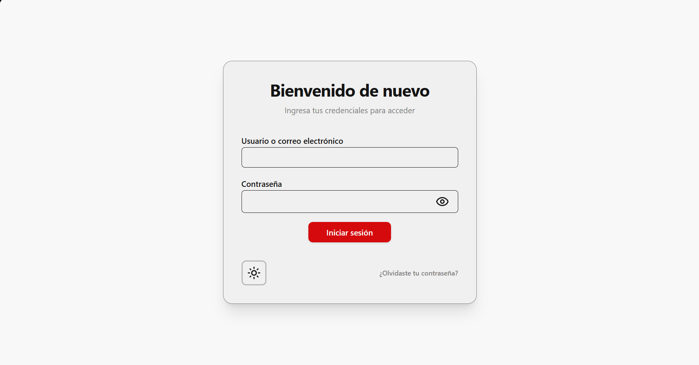

# Inicio de sesión

Para entrar al sistema:

1. Abre la pantalla de inicio.
2. Ingresa tu usuario o correo electrónico.
3. Escribe tu contraseña.
4. Haz clic en Iniciar sesión.

### Si no puedes entrar
- Verifica que el usuario y la contraseña sean correctos.
- Asegúrate de tener acceso al rol correspondiente.
- Si olvidaste tu contraseña, usa la opción de recuperar cuenta.

---

_Versión del manual: 1.0_
