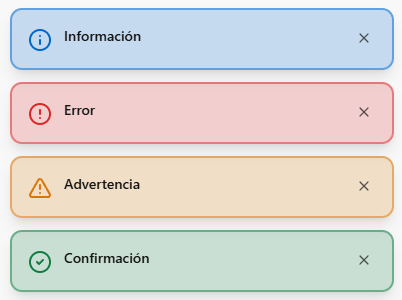

# Notificaciones del sistema

La plataforma muestra mensajes emergentes (toasts) para confirmar acciones o avisar problemas.

## Tipos de notificación
- Éxito: confirma que una acción se guardó correctamente.
- Error: indica que algo falló y debes revisar los datos.
- Información: muestra un aviso general.
- Advertencia: señala algo que requiere atención.

## ¿Dónde aparecen?
- En la parte inferior derecha de la pantalla.
- Si llegan varias, se muestran en lista.

## ¿Cuánto tiempo duran?
- Se cierran automáticamente después de unos segundos.
- También puedes cerrarlas manualmente con el botón X.

## Recomendaciones
- Si aparece un error, vuelve a revisar el formulario antes de reenviar.
- Si no ves notificaciones, recarga la página e intenta de nuevo.

---

_Versión del manual: 1.0_
