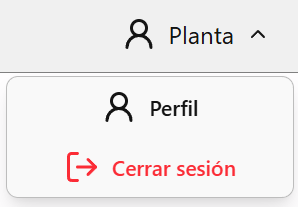
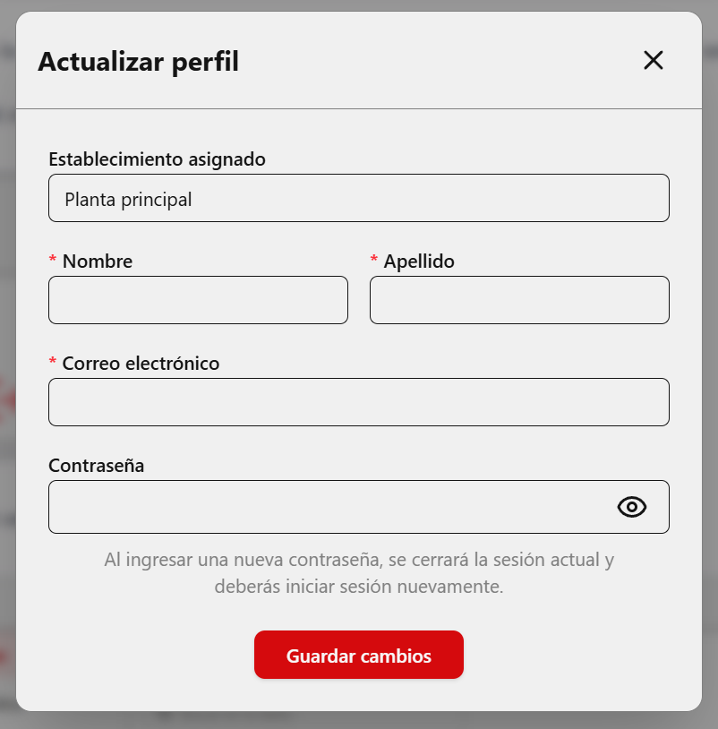

# Información personal

Desde el menú superior puedes abrir tu perfil.

## Qué puedes actualizar
- Nombre
- Apellido
- Correo electrónico
- Contraseña

## Importante
Si cambias la contraseña, el sistema cerrará la sesión actual para que vuelvas a iniciar sesión con la nueva clave.

_Ejemplo del menu desplegable del perfil_

_Ejemplo de ventana para actualizar perfil de usuario_

---

_Versión del manual: 1.0_
