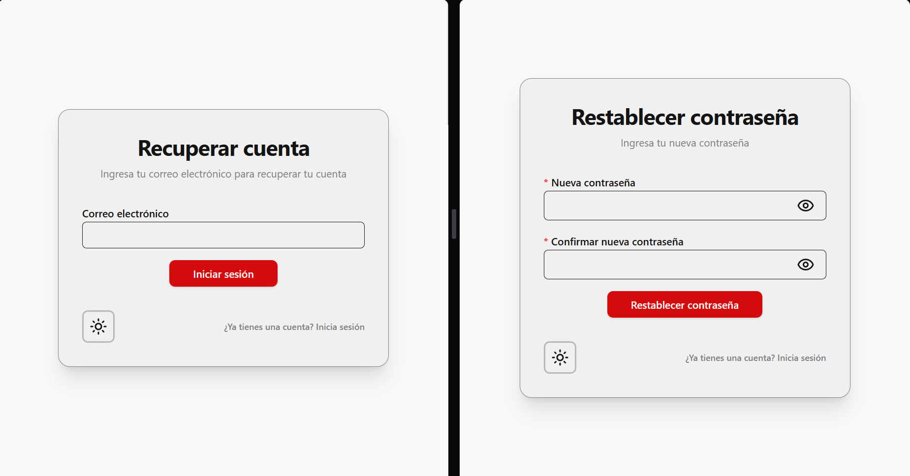

# Recuperar cuenta

Si olvidaste tu contraseña:

1. Entra a la opción Recuperar cuenta.
2. Escribe tu correo electrónico.
3. Haz clic en enviar.
4. Revisa tu correo para seguir las instrucciones.

Después de eso, accede al enlace que se adjunta en el correo para establecer una nueva contraseña. El enlace caduca pasado un tiempo limite o cuando se realiza el cambio de contraseña con ese enlace.

---

_Versión del manual: 1.0_
