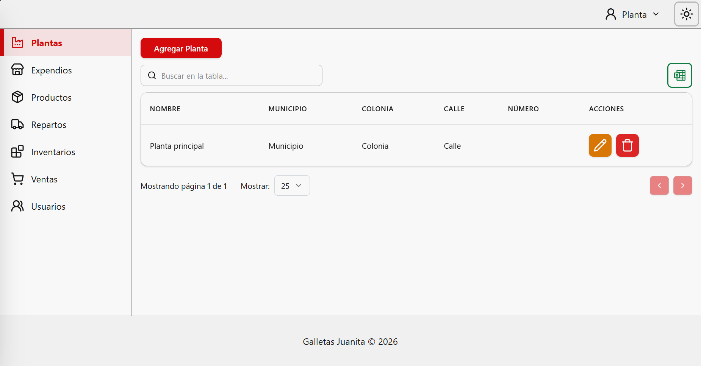
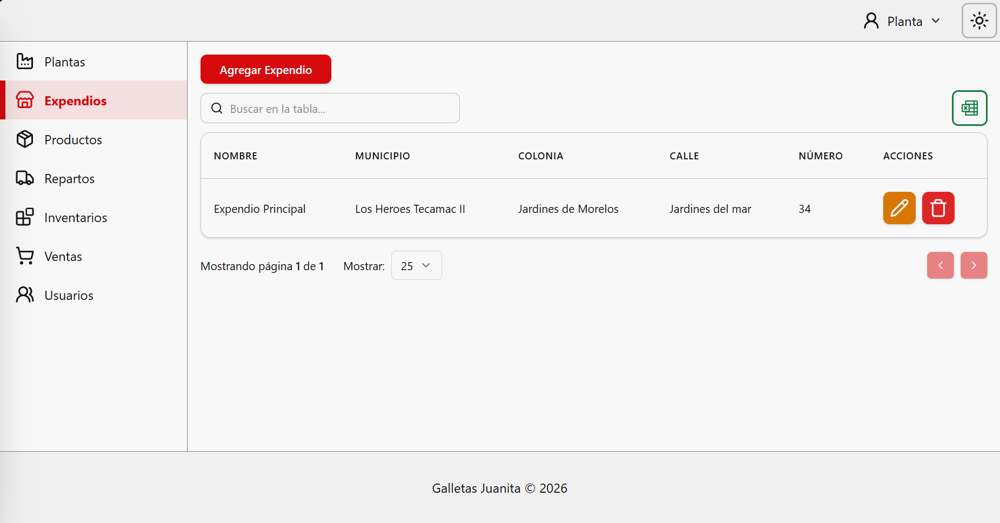
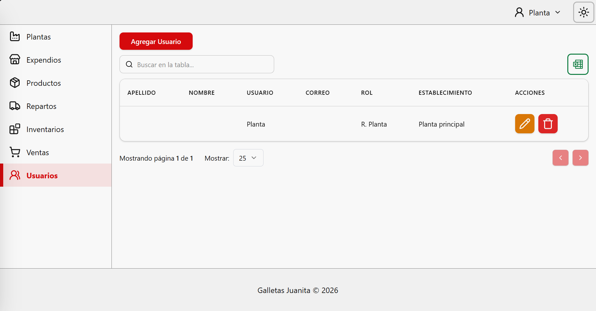

# Manual de usuario "Responsable de planta" <!-- omit in toc -->

El presente manual de usuario esta destinado para el usuario __Responsable de planta__, el cual esta destinado a la gestión general de la plataforma, se estructuran el contenido del documento de acuerdo a la disponibilidad de módulos de la barra lateral.

Dentro de la plataforma existen otras interacciones como: [iniciar sesión](./common/login.md), [recuperar cuenta](./common/recover_account.md), [navegación general](./common/general_navigation.md), [actualizar información personal](./common/profile_info.md), [carga masiva](./common/massive.md) y [exportar información](./common/export_data.md). Consulte sus respectivos manuales para más información.

## Índice <!-- omit in toc -->
- [Plantas](#plantas)
- [Expendios](#expendios)
- [Productos](#productos)
- [Repartos](#repartos)
- [Inventarios](#inventarios)
- [Ventas](#ventas)
- [Usuarios](#usuarios)

### Plantas

Este módulo permite administrar las plantas de producción registradas en el sistema. En la tabla principal se visualiza la información básica de cada una (como su nombre y dirección). Dentro de este modulo pueden realizarse las siguientes operaciones:

- Para registrar una nueva instalación, hacer clic en el botón rojo __"Agregar Planta"__.
- En la columna de _Acciones_, se ubican botones para __editar__ (icono de lápiz) o __eliminar__ (icono de bote de basura) cualquier registro existente.

---

### Expendios

Funciona de manera idéntica al [módulo de Plantas](#plantas), pero está enfocado exclusivamente en los puntos de venta. 

Aquí se consulta la lista de todas los expendios, registrar nuevos establecimientos utilizando el botón **"Agregar Expendio"**, y mantener su información actualizada utilizando los botones de edición y eliminación.

---

### Productos

Este actúa como catálogo central de mercancía. La tabla te muestra de un vistazo detalles clave como el código (SKU), el nombre, el precio y si el producto tiene variantes (las cuales puedes desplegar haciendo clic en la flecha de la columna *Variantes*), entre otros.

Existen dos formas de agregar productos:
1. **Uno por uno:** Usando el botón rojo **"Agregar Producto"**.
2. **Por volumen:** Usando el botón amarillo **"Carga masiva"** si se necesitan subir muchos productos a la vez desde un archivo excel. _(Consulte el [manual de carga masiva](./common/massive.md) para mas detalles)_

---

### Repartos

Este módulo es parte del control logístico. Aquí se visualiza el historial general de los envíos de mercancía desde las plantas hacia los expendios. 

Cada envío tiene una etiqueta de color que indica su __estado__, estos pueden ser: 
- __Pendiente__: El reparto esta registrado y pendiente de confirmación sobre su contenido a enviar.
- __En progreso__: El reparto ha confirmado el contenido del envío y se espera recepción por parte del expendio.
- __Completado__: El reparto fue recibido correctamente por parte del expendio y el contenido del envío ahora forma parte del inventario del expendio.
- __Cancelado__: El reparto tuvo un problema en alguna etapa del envío.

Los repartos que se encuentren en el estado: __Pendiente__ o __Cancelado__ pueden actualizar su contenido y destino con el botón de __Editar__.

Los repartos que no hayan sido completados pueden avanzar de etapa _(botón verde)_ o retroceder _(botón rojo)_ según sea necesario.

---

### Inventarios

Desde este módulo se consultan las existencias de mercancía por cada expendio. Es una pantalla de consulta rápida donde el sistema muestra los resultados de los productos en los inventarios, a fin de permitir tomar decisiones informadas sobre la producción o próximos repartos.

### Ventas

Aquí se refleja el historial de todas las ventas realizadas por los cajeros en los distintos expendios, mostrando la fecha, el cajero responsable y el total cobrado. 

Es importante tener en cuenta que __el sistema actualmente solo soporta y registra transacciones realizadas en efectivo__.

Si es necesario revisar el detalle de una compra específica, hacer click en el botón azul (icono de ticket) en la columna de __Acciones__ se muestra una previsualización del ticket impreso para esa venta.

---

### Usuarios

Este módulo está destinado a la administración de las cuentas del personal que tiene acceso al sistema. 

Al usar el botón __"Agregar Usuario"__, se puede registrar a nuevos colaboradores, asignarles un __Rol__ como Responsable de planta o Responsable de expendio y vincularlos directamente a la planta o expendio donde trabajan, para asegurar que solo vean la información que les corresponde. _(Para el caso de registrar nuevos responsables de planta, estos tienen la misma cantidad de permisos entre otros responsables de planta, solo cambia a que planta están asignados)_.

Al momento de registrar un nuevo usuario, este recibirá un correo electrónico con instrucciones para acceder a su cuenta.

---

_Version de manual: 1.0_
